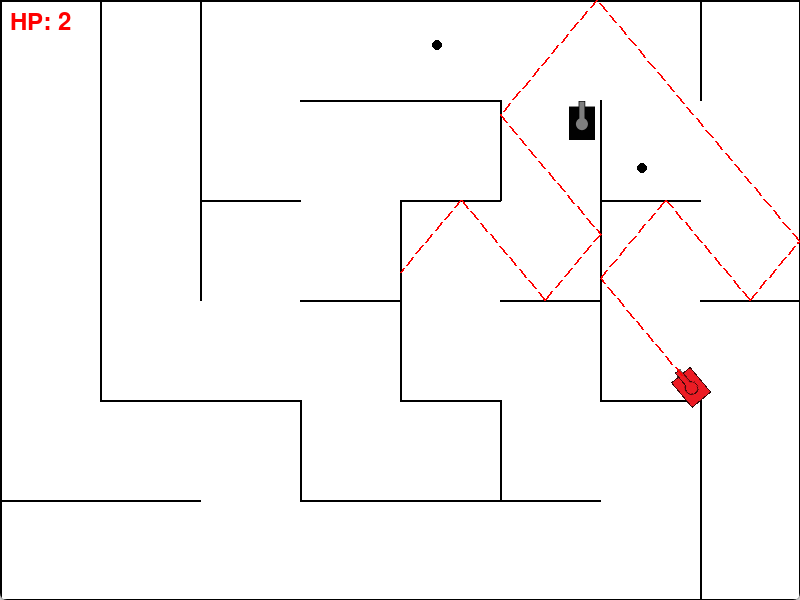

刷视频时偶然看到坦克动荡2的游戏集锦，就随便截了张图丢给cursor让它根据截图做个游戏。我全程除了画了两个坦克，网上找了发射音效外，只是体验它给的代码并且根据游玩测试结果给出反馈,让cursor一步一步修改。
整个项目包括README都是cursor写的。

---

# Tank Battle Game

一个基于Python和Pygame的简单坦克大战游戏。

## 游戏说明

- 红色坦克是玩家控制的坦克
- 黑色坦克是敌人，会自动追踪玩家
- 敌人可以发射黑色子弹（最多同时存在2颗）
- 子弹会在墙壁上反弹，最多存在10秒
- 玩家需要收集红色方块（物资）才能发射激光
- 物资每30秒在地图上随机生成一次
- 玩家收集物资后可以看到红色虚线预瞄线
- 击中敌人获胜，被子弹击中则失败

## 安装依赖

```bash
pip install -r requirements.txt
```

## 运行游戏

```bash
python game.py
```

## 控制方式

- W/A/S/D：控制坦克移动旋转
- 旋转炮管
- 空格键：发射激光（需要先收集物资） 

## 游戏界面预览

